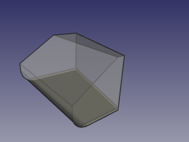
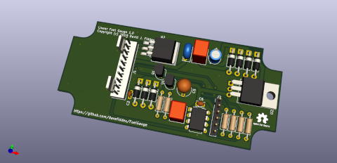
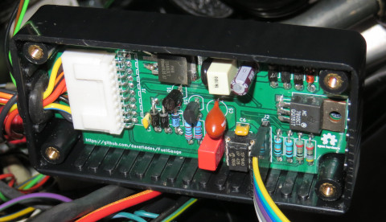

# Linear Fuel Gauge

This project allows an accurate linear fuel readout to be created for vehicles with unusually shaped fuel tanks and/or mismatched fuel senders.

## Why?

I built this for my Ultima GTR kit car which uses a conventional VDO fuel gauge and vertical float sender unit. The fuel tank on the car is a very unusual shape so it can get as much fuel as possible into a small space. This combination means that with a thirsty V8 the fuel quickly drops from 100% to 25% but takes a lot longer to go from 25% to empty. It's easy to run out of fuel!

To illustrate the scale of the problem here is a rendering of the fuel tank with 15 litres of fuel in a 34 litre tank:

Other Ultima owners have solved the problem by using their ECU or an intelligent dashboard. I have neither and wanted to preserve the original look of the Ultima branded instruments.

## How?

The Linear Fuel Gauge box sits between a standard resistance fuel sender and a hot-wire fuel gauge. The device:
 * measures the resistance of the sender (0-100 ohms)
 * maps that resistance to a linear fuel level value
 * maps the fuel level to a particular gauge output value
 * emulates the resistance value needed to achieve the required gauge output value
 
## Hardware

The gauge is built around a simple 8-pin PIC12F1840 micro-controller. The resistance of the sender is measured using a 10mA current source built from an LM317L regulator. The gauge output is achieved by feeding a PWM signal from the MCU into a high-current MOSFET driver (currents are typically around 100mA for 100%). A simple NPN-transistor driver is provided for low fuel indication. Configuration of the gauge is achieved with a 3-wire TTL serial connection to the MCU.

The project contains the full Kicad schematics and a PCB layout designed to fit in a small Hammond Manufacturing 1591ABK ABS plastic case.

Details:
 * [Schematics](hardware/FuelGauge.pdf)
 * [PCB Gerbers](hardware/gerbers/FuelGauge-1.0.zip)
 * [BOM](docs/BOM.md)
 * [Example Wiring Harness](wiring/wiring.pdf)

## Software

The gauge is implemented in C as a platform neutral core with a small hardware abstraction layer for the MCU. A full set of unit tests is provided for the core allowing easy testing and debugging to be carried out on a PC before building for the MCU. The MCU firmware is built using the Microchip MPLAB X IDE v5.15 and xc8 v2.05 compiler (Free Version).

 The gauge has two 9 bin maps that allow fine grained mapping of:
 * the input resistance to a linear fuel level
 * the linear fuel level to a PWM gauge output value

 The calibration of the two maps is achieved using a serial connection. The core implements a command processor allowing values in each of the maps to be modified and saved to EEPROM. During calibration the gauge output can be tested and the resistance of the fuel sender measured independently.

 The [Calibration And Programming Guide](docs/user-guide.md) details how to set up the fuel gauge which should mostly be a one-time exercise.

 ## License

 The device hardware and software is covered by the GNU General Public License v3.